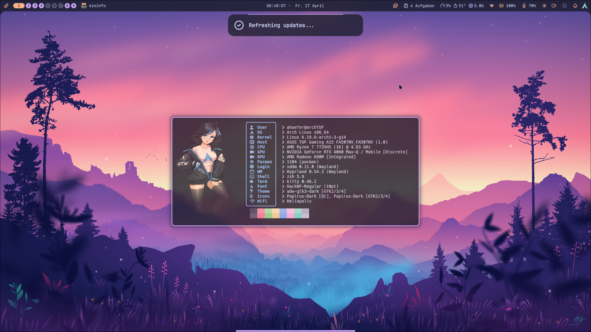
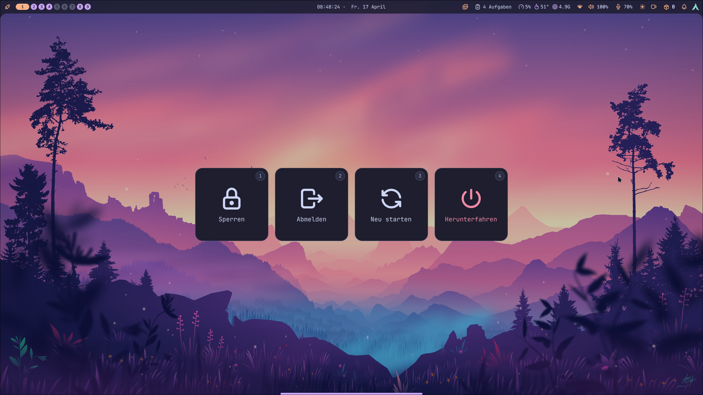
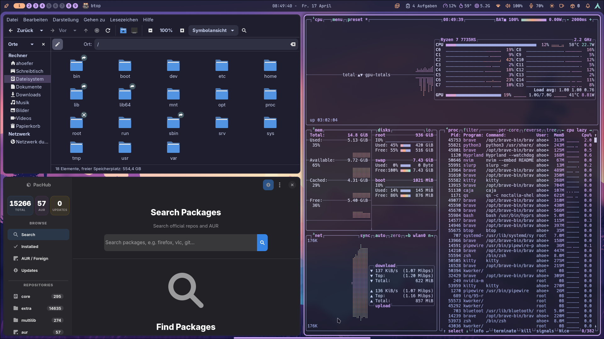

# dotfiles

---
* **OS**:         Arch Linux x86_64
* **WM**:         [Hyprland](https://github.com/hyprwm/Hyprland)
* **Terminal**:   [kitty](https://github.com/kovidgoyal/kitty)
* **Shell**:      [OhMyZsh](https://github.com/ohmyzsh/ohmyzsh)
  * **Prompt**:   [Starship](https://github.com/starship/starship)
* **Menus**:      [Rofi-Wayland](https://github.com/lbonn/rofi)
* **Lockscreen**: [Hyprlock](https://github.com/hyprwm/hyprlock) / [Hypridle](https://github.com/hyprwm/hypridle)
* **Theme**:      [Nordic](https://github.com/EliverLara/Nordic)
* **Icons**:      [Nordzy-dark](https://github.com/alvatip/Nordzy-icon)
* **Notify**:     [swaync](https://github.com/ErikReider/SwayNotificationCenter)
* **Info**:       [fastfetch](https://github.com/fastfetch-cli/fastfetch)
* **Music**:      [spotify-player](https://github.com/aome510/spotify-player) + [cava](https://github.com/karlstav/cava) + [sptlrx](https://github.com/raitonoberu/sptlrx)

#### changelog:
* **2024-07-02**: some theme changes for swaync and managed dotfiles with stow
* **2024-06-30**: Add SwayNC
* **2024-06-17**: switched from ncspot to spotify-player
* **2024-06-20**: new theme with hyprlock taskbar and Rofi-Wayland for menus
* **2024-05-08**: changde to top and bottom bar incl. start menu, launcher
* **2023-07-05**: updated waybar config, window rule for virt-manager
* **2023-06-28**: updated ncmpcpp config incl. dynamic kitty setup for second window with cava
---

