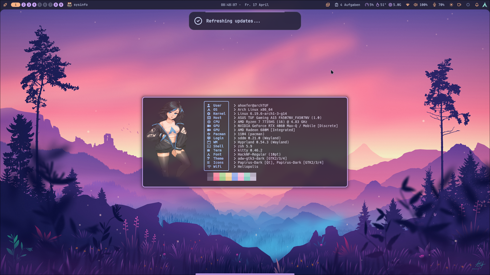
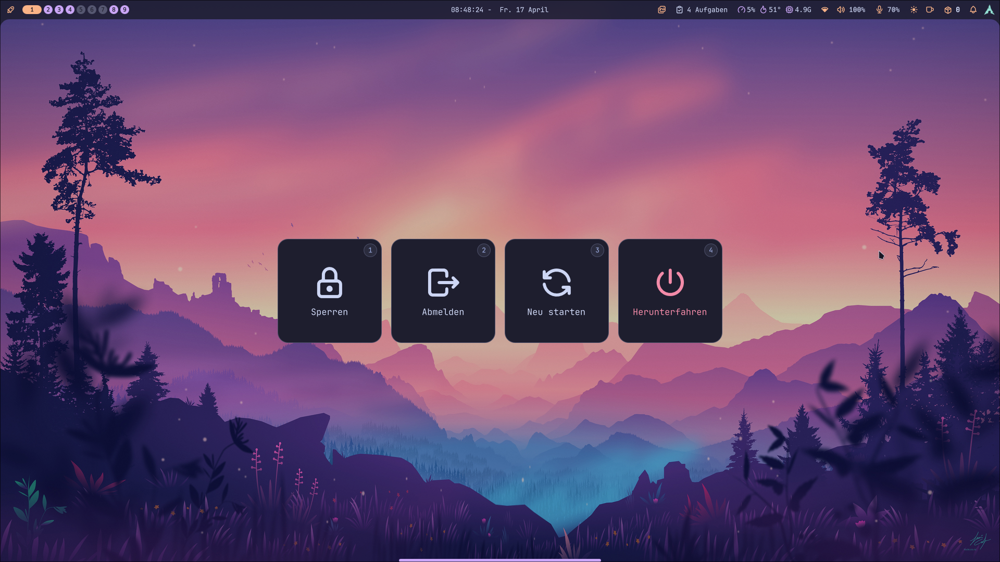
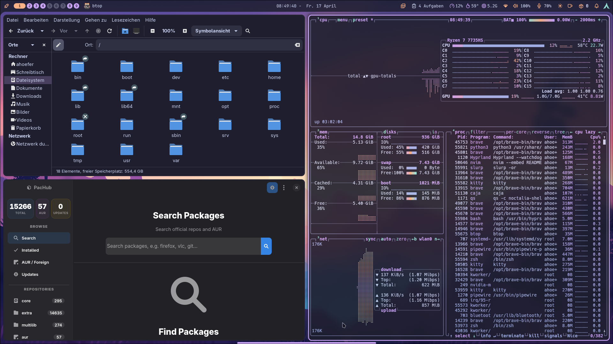

# dotfiles

managed by chezmoi (https://www.chezmoi.io/)

---

- **OS**: Arch Linux x86_64
- **WM**: [Hyprland](https://github.com/hyprwm/Hyprland)
- **Terminal**: [kitty](https://github.com/kovidgoyal/kitty)
- **Shell**: Zsh
  - **Prompt**: [Starship](https://github.com/starship/starship)
  - **some plugins**:
- **Noctalia QS Shell**
- **Login**: sddm Noctalia theme
- **GTK Theme**: [adw-gtk3-dark]
- **Icons**: [Papirus-Dark](https://github.com/PapirusDevelopmentTeam/papirus-icon-theme)
- **Notify**: [swaync](https://github.com/ErikReider/SwayNotificationCenter)
- **Info**: [fastfetch](https://github.com/fastfetch-cli/fastfetch)

---

