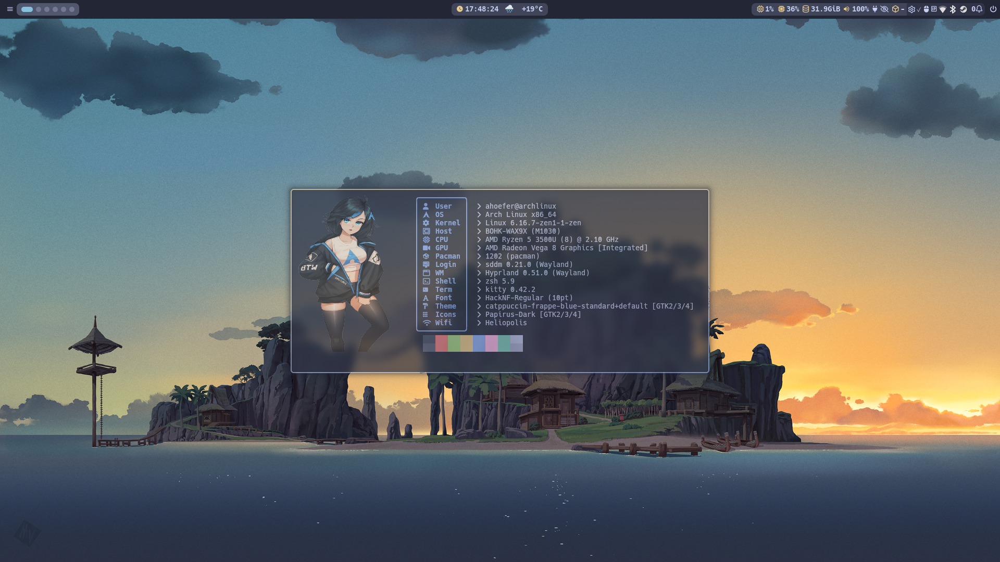
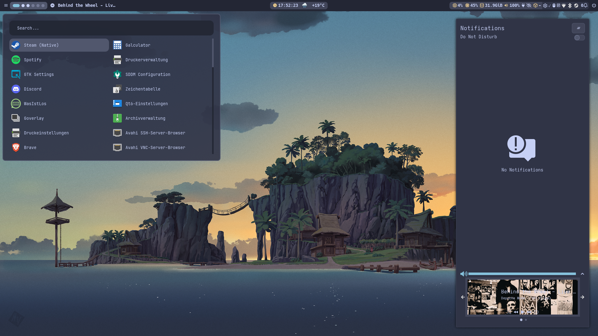

# dotfiles

---

- **OS**: Arch Linux x86_64
- **WM**: [Hyprland](https://github.com/hyprwm/Hyprland)
- **Terminal**: [kitty](https://github.com/kovidgoyal/kitty)
- **Shell**: Zsh
  - **Prompt**: [Starship](https://github.com/starship/starship)
  - **some plugins**:
- **Menus**: [Rofi](https://github.com/davatorium/rofi)
- **Lockscreen**: [Hyprlock](https://github.com/hyprwm/hyprlock) / [Hypridle](https://github.com/hyprwm/hypridle)
- **Login**: sddm Catppuccin theme
- **Theme**: [Catppuccin](https://github.com/Fausto-Korpsvart/Catppuccin-GTK-Theme.git)
  - **sassc**: required for theme build
- **Icons**: [Papirus-Dark](https://github.com/PapirusDevelopmentTeam/papirus-icon-theme)
- **Notify**: [swaync](https://github.com/ErikReider/SwayNotificationCenter)
- **Info**: [fastfetch](https://github.com/fastfetch-cli/fastfetch)

#### changelog

- **2025-09-20**: add xdg-desktop-portal-hyprland and eza theme
- **2024-07-02**: some theme changes for swaync and managed dotfiles with stow
- **2024-06-30**: Add SwayNC
- **2024-06-17**: switched from ncspot to spotify-player
- **2024-06-20**: new theme with hyprlock taskbar and Rofi-Wayland for menus
- **2024-05-08**: changde to top and bottom bar incl. start menu, launcher
- **2023-07-05**: updated waybar config, window rule for virt-manager
- **2023-06-28**: updated ncmpcpp config incl. dynamic kitty setup for second window with cava

---

