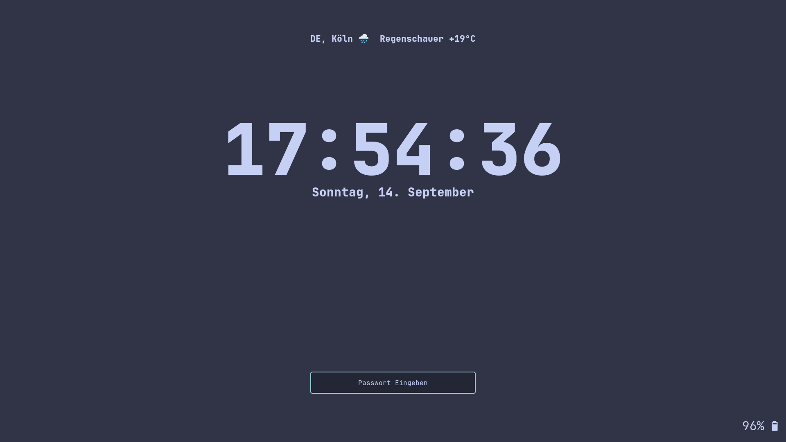
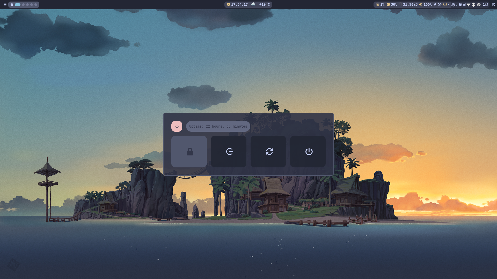

# dotfiles

---
* **OS**:         Arch Linux x86_64
* **WM**:         Hyprland
* **Terminal**:   kitty
* **Shell**:      zsh
  * **Prompt**:   Starship
* **Menus**:      rofi-wayland
* **Lockscreen**: Hyprlock
* **Theme**:      Nordic
* **Icons**:      Nordzy-dark

#### changelog:
* **2024-06-20**: new theme with hyprlock taskbar and rofi-wayland for menus
* **2024-05-08**: changde to top and bottom bar incl. start menu, launcher
* **2023-07-05**: updated waybar config, window rule for virt-manager
* **2023-06-28**: updated ncmpcpp config incl. dynamic kitty setup for second window with cava
---

